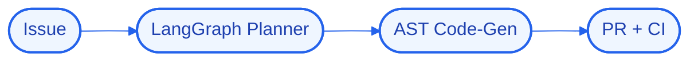

# Architecture — AutoForge

## High-Level Design (HLD)
AutoForge takes an issue, plans the change with a LangGraph agent, generates code via AST-aware edits, and opens a PR that runs through CI — automating the routine parts of the engineering lifecycle.

**Flow:** Issue → LangGraph Planner → AST Code-Gen → PR + CI

## Low-Level Design (LLD)
- **Components:** `LangGraph`, `OpenAI`, `Docker`
- **Interfaces / contracts:** to be finalized during implementation.
- **Data model:** to be defined per component.

## Decision Log
- **Why this stack:** **LangGraph** — stateful multi-agent orchestration; **OpenAI** — cloud llm reasoning; **Docker** — containerized local deployment.
- ** constraint:** run logic/state/UI locally; offload heavy reasoning to cloud APIs; target modest hardware.

## Concept Deep Dive
Keeping an autonomous coding agent correct and reviewable rather than confidently wrong.
